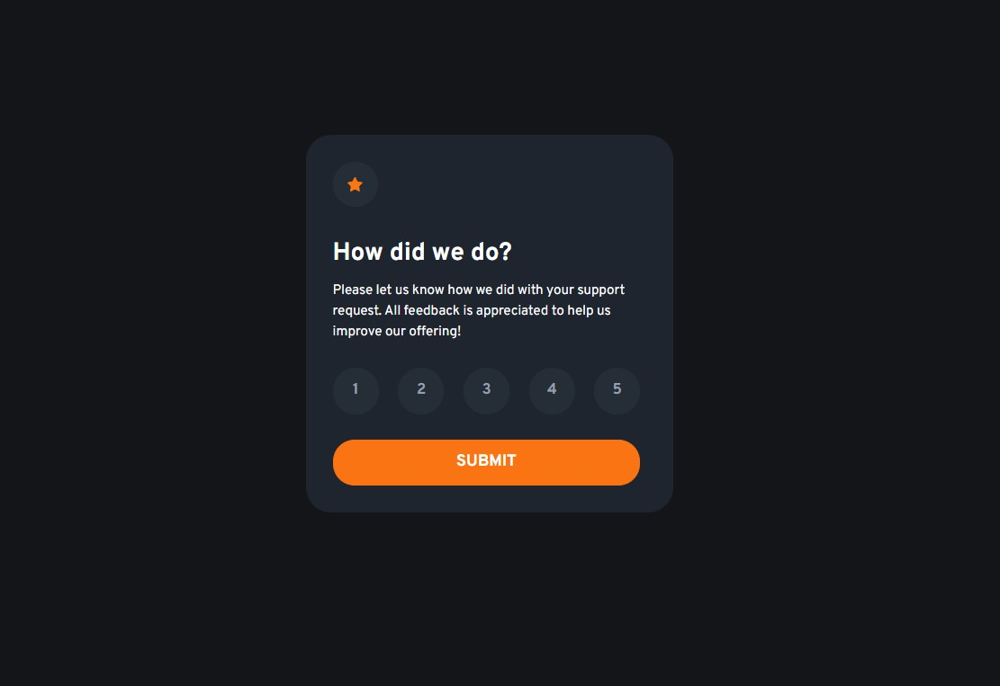

# Frontend Mentor - Interactive rating component solution

This is a solution to the [Interactive rating component challenge on Frontend Mentor](https://www.frontendmentor.io/challenges/interactive-rating-component-koxpeBUmI). Frontend Mentor challenges help you improve your coding skills by building realistic projects.

## Table of contents

- [Overview](#overview)
  - [The challenge](#the-challenge)
  - [Screenshot](#screenshot)
  - [Links](#links)
- [My process](#my-process)
  - [Built with](#built-with)
  - [What I learned](#what-i-learned)
  - [Useful resources](#useful-resources)
- [Author](#author)

**Note: Delete this note and update the table of contents based on what sections you keep.**

## Overview

### The challenge

Users should be able to:

- View the optimal layout for the app depending on their device's screen size
- See hover states for all interactive elements on the page
- Select and submit a number rating
- See the "Thank you" card state after submitting a rating

### Screenshot

### Links

- Solution URL: [github](https://github.com/denis-farkas/interactive-rating-component-main)
- Live Site URL: [live](https://cloudefar.fr/interactive-rating-component-main/)

## My process

### Built with

- Semantic HTML5 markup
- CSS custom properties
- Flexbox
- Desktop-first workflow
- Javascript

### What I learned

I forgoted that we can display none an input-radio and format the label like we want. The click on the label give checked for input-radio. Good choice!

### Useful resources

- [Rating system](https://codepen.io/lsirivong/pen/nRNLYL) - This helped me for input radio, label, etc. Nice tricks.
- [input radio, form, formData](https://developer.mozilla.org/fr/docs/Web/HTML/Element/Input/radio#mettre_en_forme_les_boutons_radio) - This is a good article which helped me a lot.

## Author

- Website - [Portfolio](https://denis-farkas.students-laplateforme.io/)
- Frontend Mentor - [@denis-farkas](https://www.frontendmentor.io/profile/denis-farkas)
